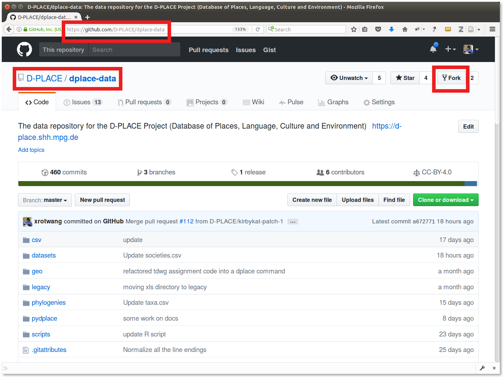
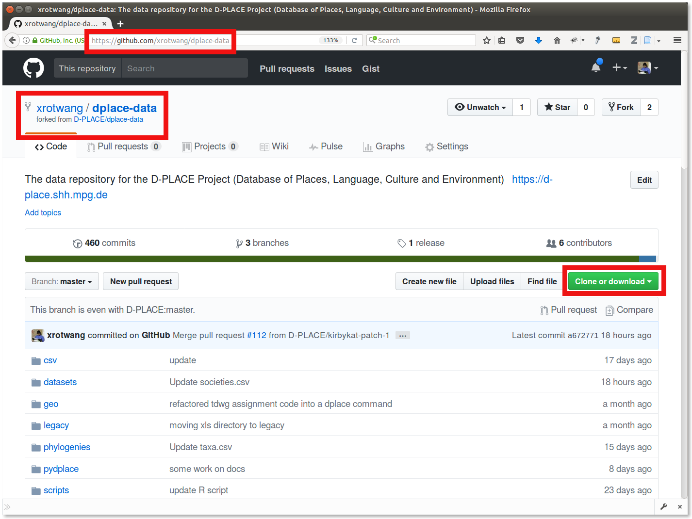

# Data curation with git and GitHub

We already learned about the advantages of using git and GitHub to collaborate on research projects.
A special kind of research project is the curation of a dataset. For research data to be amenable for
curation via git means:

- it should consist of a collection of text files
- individual text files should not be too big, and have a line-based format

It turns out that quite a few datasets important to us can be modelled in this way, and CSV - everyone's 
favorite format for tabular data - is gaining popularity every day:

- [Glottolog](https://github.com/clld/glottolog):
  - Bibliographic information is stored as set of BibTeX files
  - Language information is stored as one INI file per language
  - directory tree models the language classification

- [D-PLACE](https://github.com/D-PLACE/dplace-data):
  - Trees are stored as NEXUS files

- [Concepticon](https://github.com/clld/concepticon-data):
  - Each concept list is just a CSV file

- [Gelato](https://github.com/gelato-org/gelato-data):
  - modelled following the D-PLACE repository

For relational data, though, this approach sacrifices a built-in mechanism to enforce referential integrity
(which relational databases provide - see https://github.com/shh-dlce/qmss-2016/blob/master/masterclass/data-curation-sql.pdf). But this can be alleviated using scripts to check data consistency
(and using the GitHub platform these checks could be run automatically).

See also https://github.com/clld/lanclid2/blob/master/presentations/forkel.pdf

## Example: D-PLACE

- fork the repository
  
  will create your personal copy of the repository
  

- clone your fork on your machine
  ```bash
  git clone git@github.com:xrotwang/dplace-data.git
  ```
- navigate the data in your file-system
  - `du`: Investigate disk usage
    ```bash
    $ du -sh .
    144M
    ```
  - `ls`: List directory contents
    ```bash
    $ ls -1
    csv
    datasets
    geo
    legacy
    LICENSE.txt
    phylogenies
    pydplace
    README.md
    RELEASING.md
    scripts
    setup.cfg
    setup.py
    SOURCES.md
    tox.ini
    ```
  - `tree`: Look at directory trees (not in git bash for windows)
  - `head`: Inspect the first couple of lines in a file
    ```bash
    $ head datasets/sources.bib 
    # -*- coding: utf-8 -*-
    @book{abadie1924,
      author = {Abadie, Maurice},
      title = {Les races du Haut-Tonkin},
      address = {Paris},
      year = {1924},
      url = {https://archive.org/details/McGillLibrary-103431-303},
      key = {Abadie (1924)}
    }
    @article{abasadse1894,
    ```
  - `grep`:
    ```bash
    $ grep "@" datasets/sources.bib
    ```
  - Pipes:
    ```bash
    $ grep "@" datasets/sources.bib | wc -l
    3980
    ```


## Collaboration

Curating data using git and GitHub means you can also use the well-established
[fork & pull request workflow](https://gist.github.com/Chaser324/ce0505fbed06b947d962)
to work on the data collaboratively.


## Example: Glottolog

https://github.com/clld/glottolog/pull/84


## Adding an API to the data

If we already have scripts to check consistency of the data, it is only one more step to turn these
scripts into a full-fledged API to the data, i.e. provide programmatic access to the data.


### Example: Concepticon

With the data being accessible programmatically, it is easy to write 
[short scripts](https://github.com/clld/concepticon-data/blob/master/pyconcepticon/commands.py#L290-L305) to
summarize information, e.g. to create tables of contents like
https://github.com/clld/concepticon-data/blob/master/concepticondata/conceptlists/README.md


### Example: Glottolog

- Fork and clone [`clld/glottolog`](https://github.com/clld/glottolog)
- Install `pyglottolog` running
  ```bash
  cd glottolog
  python setup.py develop
  ```

Using the API, a common task like mapping ISO 639-3 codes to Glottocodes can be done
programmatically as follows:

```python
>>> from pyglottolog.api import Glottolog
>>> from clldutils.dsv import UnicodeWriter
>>> glottolog = Glottolog()
>>> with UnicodeWriter('gc2iso.csv') as writer:
...     writer.writerow(['glottocode', 'name', 'iso639-3'])
...     for languoid in glottolog.languoids():
...         if languoid.iso:
...             writer.writerow([languoid.id, languoid.name, languoid.iso])
... 
```

Et voilà

```bash
$ head -n 5 gc2iso.csv 
glottocode,name,iso639-3
mero1237,Meroitic,xmr
sape1238,Sapé,spc
kara1497,Karami,xar
chit1248,Chitimacha,ctm
```

## Using the API to build a CLI

Once we have an API to access the data, providing access to common functions from the 
command line is easy. Thus, when we installed `pyglottolog`, we also installed a command
`glottolog`:

```bash
$ glottolog --help
usage: glottolog [-h] [--verbosity VERBOSITY] [--log-level LOG_LEVEL]
                 [--repos REPOS]
                 command ...

Main command line interface of the pyglottolog package.

positional arguments:
  command               isobib | show | edit | create | bib | tree | newick |
                        index | check | metadata | refsearch | refindex |
                        langsearch | langindex | tree2lff | lff2tree
  args

optional arguments:
  -h, --help            show this help message and exit
  --verbosity VERBOSITY
                        increase output verbosity
  --log-level LOG_LEVEL
                        log level [ERROR|WARN|INFO|DEBUG]
  --repos REPOS         path to glottolog data repository

Use 'glottolog help <cmd>' to get help about individual commands.
```

```bash
$ glottolog tree stan1295
Indo-European [indo1319]
   └─ Germanic [germ1287]
      └─ Northwest Germanic [nort3152]
         └─ West Germanic [west2793]
            └─ Franconian [fran1268]
               └─ High Franconian [high1287]
                  └─ German [stan1295]
                     ├─ Alsatian [alsa1241]
                     ├─ Berlin German [berl1235]
                     ├─ Hannover German [hann1239]
                     └─ Mansfeld German [mans1257]
```


## Using the API to feed a web application

Having an API to access the data also makes it simple to repurpose the data, e.g.
load it into a database which powers a web application. This is how we operate

- https://d-place.org
- http://glottolog.org

and a couple other websites.


## Using the API as stable interface when moving the backend

Using the API as the (only) way to access the data also offers some flexibility.
Should flat file storage become a problem (maybe because of bad performance),
switching to a relational database like SQLite for storage could be done without
breaking client code accessing the data.

Caveat: While the API is certainly the right thing to keep stable, losing direct access to the data files
may be a problem.


## Summary

It's still early days for this model of data curation, but given its potential for collaborative enhancement
of both data and API, we want to make it known to the people who could make use of the data as well as contribute
to the curation.
